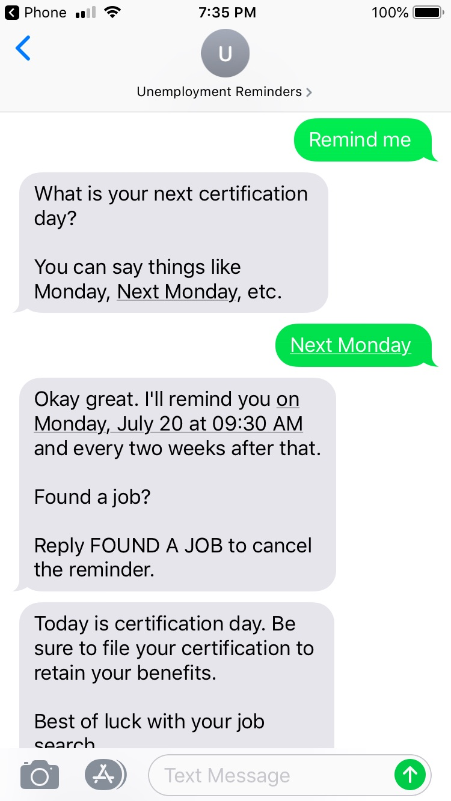

# Unemployment Reminders

Send yourself a Twilio SMS reminder on your unemployment certification date.

#### Disclaimer

This application is for demo purposes only. It is not affiliated with or endorsed by the 
Illinois Department of Employment Security.

# Blog Post

I wrote a [blog post](https://www.crucialwebstudio.com/blog/unemployment-reminders) about the 
idea behind the project and the development process.

# Developers

For developers interested in collaborating on this project there are some rough 
instructions [here](docs/DEVELOPERS.md). I'm sure there are some steps missing 
from the docs so feel free to reach out with any questions.

This is my first python project so I'd be happy to entertain pull requests, feature 
ideas, and code reviews.

If you happen to work at an awesome company I'm also [looking for a job](https://www.linkedin.com/in/danbowen2/).
